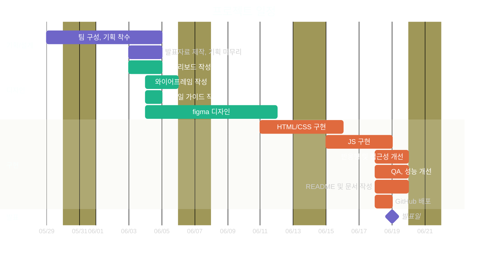

# 👓 ROUNZ 웹페이지 반응형 리뉴얼 프로젝트

ESTsoft 오르미 프론트엔드 13기 2차 팀 프로젝트로 진행한 **ROUNZ 웹사이트 리뉴얼 프로젝트**입니다.

기존 ROUNZ의 핵심 서비스인 **AI 가상 피팅**과 **얼굴형 추천 서비스**가 메인 화면에서 충분히 드러나지 않는 점, 그리고 **모바일 중심 구조로 인해 PC 및 태블릿 환경의 사용자 경험이 부족한 점**을 주요 문제로 정의하고 리뉴얼을 진행하였습니다.

AI 경험을 메인 화면 전면에 배치하고 탐색부터 구매까지 이어지는 사용자 흐름을 재설계하여, 사용자가 자연스럽게 AI 서비스를 경험한 뒤 상품 탐색과 구매까지 이어질 수 있는 일관된 쇼핑 경험을 제공하는 것을 목표로 하였습니다.

> AI로 찾은 완벽한 핏, 막힘없이 이어지는 여정

---

# 🔗 프로젝트 링크

### Deploy

https://yoonji220.github.io/EST_FE_13_2nd_ROUNZ_Renewal/

### GitHub

https://github.com/yoonji220/EST_FE_13_2nd_ROUNZ_Renewal

### 발표 자료

https://www.figma.com/deck/gsmVjD9kU0XdmdFdbwLVsR

### Figma

https://www.figma.com/design/kZYfAsKXLNXvKo9CCA0ypU/Cookie-Session---Design

---

# 📅 프로젝트 정보

| 항목          | 내용                                  |
| ------------- | ------------------------------------- |
| 과정명        | 오르미 프론트엔드 13기                |
| 프로젝트명    | ROUNZ 웹페이지 반응형 리뉴얼 프로젝트 |
| 프로젝트 기간 | 2026.05.29 ~ 2026.06.19               |
| 팀명          | Cookie & Session                      |
| 항목          | 내용                                  |
| ------------- | ------------------------------------- |
| 과정명        | 오르미 프론트엔드 13기                |
| 프로젝트명    | ROUNZ 웹페이지 반응형 리뉴얼 프로젝트 |
| 프로젝트 기간 | 2026.05.29 ~ 2026.06.19               |
| 팀명          | Cookie & Session                      |

---

# 🎯 프로젝트 목표

### 반응형 웹 구현

- Mobile First 방식 적용
- PC · Tablet · Mobile 환경 대응
- 디바이스별 최적화된 레이아웃 제공
- 반응형 상품 그리드 구현
- Mobile First 방식 적용
- PC · Tablet · Mobile 환경 대응
- 디바이스별 최적화된 레이아웃 제공
- 반응형 상품 그리드 구현

### AI 서비스 경험 강화

- AI 가상 피팅 노출 강화
- 얼굴형 추천 서비스 강조
- 비디오 기반 Hero Banner 적용
- 서비스 핵심 가치 전달 강화
- AI 가상 피팅 노출 강화
- 얼굴형 추천 서비스 강조
- 비디오 기반 Hero Banner 적용
- 서비스 핵심 가치 전달 강화

### 사용자 흐름 개선

- 복잡한 콘텐츠 구조 단순화
- 탐색 → 비교 → 구매 흐름 개선
- 장바구니 및 구매 동선 개선
- 로그인 및 회원가입 접근성 향상
- 복잡한 콘텐츠 구조 단순화
- 탐색 → 비교 → 구매 흐름 개선
- 장바구니 및 구매 동선 개선
- 로그인 및 회원가입 접근성 향상

### 웹 품질 개선

- WebP 이미지 적용
- Lazy Loading 적용
- Skeleton UI 적용
- 웹 접근성 개선
- 웹 표준 준수
- WebP 이미지 적용
- Lazy Loading 적용
- Skeleton UI 적용
- 웹 접근성 개선
- 웹 표준 준수

---

# 🛠 기술 스택

### Design

- Figma
- Figma

### Frontend

- HTML5
- CSS3
- Vanilla JavaScript (ES6+)
- Swiper.js
- HTML5
- CSS3
- Vanilla JavaScript (ES6+)
- Swiper.js

### Data

- JSON
- Fetch API
- JSON
- Fetch API

### Collaboration

- GitHub
- GitHub Pull Request
- GitHub
- GitHub Pull Request

---

# 👥 팀 구성 및 역할

| 이름   | 역할 | 세부 담당                                                | GitHub        | Email                                                   |
| ------ | ---- | -------------------------------------------------------- | ------------- | ------------------------------------------------------- |
| 최윤지 | 팀장 | 기획 · 디자인 · 상품 상세 페이지                         | yoonji220     | [choiyj220220@gmail.com](mailto:choiyj220220@gmail.com) |
| 김정우 | 팀원 | 기획 · 디자인 · 회원가입 · Git 관리 · 공통 Header/Footer | GitHub ID     | [casperjwk@gmail.com](mailto:casperjwk@gmail.com)       |
| 권유진 | 팀원 | 기획 · 디자인 · 메인 페이지 · 회의록 작성                | GitHub ID     | Email                                                   |
| 남윤동 | 팀원 | 기획 · 디자인 · 장바구니 · 필터 · 로그인 페이지          | dbsehd125-bot | [dbsehd125@gmail.com] Email                             |
| 이민호 | 팀원 | 기획 · 디자인 · 매장 찾기 페이지                         | [minho0391]   | (minh05@naver.com)                                      |

---

# 📄 페이지 구성

### 메인 페이지

- Hero Video Banner
- AI 가상 피팅 소개
- 브랜드 추천
- 이벤트 및 프로모션
- 비디오 제어 기능
- Hero Video Banner
- AI 가상 피팅 소개
- 브랜드 추천
- 이벤트 및 프로모션
- 비디오 제어 기능

### 상품 목록 페이지

- 상품 비동기 렌더링
- 상품 필터
- 상품 정렬
- 더보기 기능
- 상품 비동기 렌더링
- 상품 필터
- 상품 정렬
- 더보기 기능

### 상품 상세 페이지

- URL Parameter 기반 비동기 렌더링
- 브레드크럼
- AI 가상 피팅 섹션
- 브랜드 소개
- 상품 상세 정보
- 추천 상품
- URL Parameter 기반 비동기 렌더링
- 브레드크럼
- AI 가상 피팅 섹션
- 브랜드 소개
- 상품 상세 정보
- 추천 상품

### 장바구니 페이지

- 상품 수량 변경
- 총 금액 계산
- 추천 상품 노출
- 구매 바텀시트
- 상품 수량 변경
- 총 금액 계산
- 추천 상품 노출
- 구매 바텀시트

### 로그인 / 회원가입 페이지

- 로그인
- 회원가입
- 입력값 유효성 검사
- 로그인
- 회원가입
- 입력값 유효성 검사

### 매장 찾기 페이지

- 매장 데이터 기반 비동기 렌더링
- 매장 검색/필터/정렬
- PC 사이드바 리스트와 지도 마커 연동
- 네이버 지도 API 기반 매장 위치 표시
- 선택 매장 마커 강조 및 지도 중심 이동
- 사용자 현재 위치 기반 위치 안내 -모바일 tel: 속성 기반 전화 연결

---

# ✨ 주요 구현 내용

- Mobile First 반응형 웹 구현
- JSON 데이터 기반 비동기 렌더링
- 상품 필터 및 정렬 기능
- 상품 더보기 기능
- 상품 상세 페이지 동적 렌더링
- 구매 바텀시트 구현
- Hero Video 제어 기능
- Toast UI 구현
- Skeleton UI 구현
- Breadcrumb Navigation 구현
- WebP 이미지 최적화
- 접근성 개선
- Mobile First 반응형 웹 구현
- JSON 데이터 기반 비동기 렌더링
- 상품 필터 및 정렬 기능
- 상품 더보기 기능
- 상품 상세 페이지 동적 렌더링
- 구매 바텀시트 구현
- Hero Video 제어 기능
- Toast UI 구현
- Skeleton UI 구현
- Breadcrumb Navigation 구현
- WebP 이미지 최적화
- 접근성 개선

---

# 📂 프로젝트 구조

```text
EST_FE_13_2nd_ROUNZ_Renewal - Cookie & Session
│
├── index.html              # 메인 페이지
├── filters.html            # 상품 목록 페이지
├── filters_open.html       # 모바일 필터 페이지
├── product_detail.html     # 상품 상세 페이지
├── cart.html               # 장바구니 페이지
├── login.html              # 로그인 페이지
├── new-account.html        # 회원가입 페이지
├── stores-location.html    # 매장 찾기 페이지
├── common.html             # 공통 컴포넌트 확인용 페이지
│
├── css/
│   ├── common.css          # 공통 스타일
│   ├── reset.css           # 브라우저 기본 스타일 초기화
│   ├── normalize.css       # 브라우저 스타일 표준화
│   ├── font-utility.css    # 폰트 유틸리티 클래스
│   ├── flex-utility.css    # Flex 유틸리티 클래스
│   ├── index.css           # 메인 페이지 스타일
│   ├── filters.css         # 상품 목록 페이지 스타일
│   ├── filters_open.css    # 모바일 필터 페이지 스타일
│   ├── product-detail.css  # 상품 상세 페이지 스타일
│   ├── cart.css            # 장바구니 페이지 스타일
│   ├── login.css           # 로그인 페이지 스타일
│   ├── new-account.css     # 회원가입 페이지 스타일
│   └── stores-location.css # 매장 찾기 페이지 스타일
│
├── js/
│   ├── modules/
│   │   ├── header.js       # 공통 Header 모듈
│   │   └── footer.js       # 공통 Footer 모듈
│   │
│   └── utils/
│       ├── common.js       # 공통 JavaScript
│       ├── main.js         # 공통 실행 스크립트
│       ├── index.js        # 메인 페이지 기능
│       ├── filters.js      # 상품 목록 필터/정렬 기능
│       ├── filters-open.js # 모바일 필터 기능
│       ├── product_detail.js # 상품 상세 페이지 기능
│       ├── cart.js         # 장바구니 기능
│       ├── login.js        # 로그인/회원가입 관련 기능
│       └── stores-location.js # 매장 찾기 기능
│
└── data/
    ├── products.json       # 상품 데이터
    ├── brand.json          # 브랜드 데이터
    ├── stores.json         # 매장 데이터
    ├── notices.json        # 공지사항 데이터
    └── events.json         # 이벤트 데이터
```

---

# 📱 반응형 기준

| Device  | Breakpoint                      |
| ------- | ------------------------------- |
| Mobile  | 480px 이하                      |
| Tablet  | 481px ~ 768px                   |
| Device  | Breakpoint                      |
| ------- | ------------------------------- |
| Mobile  | 480px 이하                      |
| Tablet  | 481px ~ 768px                   |
| Desktop | 769px 이상 (1440px 기준 디자인) |

---

# 🗓 프로젝트 일정



---

# ✅ 구현 단계 진행 과정

> 구현 시작일을 1일차로 한 일자별 진행 기록입니다.

### 1일차 - 기획 및 환경 세팅

- ROUNZ 기존 메인페이지 구조 분석 (레이아웃 · UI/UX)
- Figma 와이어프레임 제작
- 필수 기능 범위 정의 (비동기 데이터 렌더링, 예외 처리)
- GitHub Repository 생성 및 협업 환경 세팅
- 프로젝트 폴더 구조 설계 (`/css`, `/js`, `/data` 등)
- ROUNZ 기존 메인페이지 구조 분석 (레이아웃 · UI/UX)
- Figma 와이어프레임 제작
- 필수 기능 범위 정의 (비동기 데이터 렌더링, 예외 처리)
- GitHub Repository 생성 및 협업 환경 세팅
- 프로젝트 폴더 구조 설계 (`/css`, `/js`, `/data` 등)

### 2일차 - 공통 구조 구축

- HTML 시맨틱 구조 작성 (`header`, `nav`, `main`, `footer`)
- 공통 Header · Footer 마크업 및 스타일 구현
- 공통 스타일 가이드 및 CSS 변수 정의
- Reset CSS 및 Normalize CSS 적용
- HTML 시맨틱 구조 작성 (`header`, `nav`, `main`, `footer`)
- 공통 Header · Footer 마크업 및 스타일 구현
- 공통 스타일 가이드 및 CSS 변수 정의
- Reset CSS 및 Normalize CSS 적용

### 3일차 - 메인 페이지 구현

- Hero Banner, 추천 상품, 이벤트 영역 마크업
- 반응형 레이아웃 및 상품 그리드 구현
- JavaScript 기반 비동기 데이터 렌더링 구현
- 데이터 로딩 실패 시 예외 처리 로직 적용
- Hero Banner, 추천 상품, 이벤트 영역 마크업
- 반응형 레이아웃 및 상품 그리드 구현
- JavaScript 기반 비동기 데이터 렌더링 구현
- 데이터 로딩 실패 시 예외 처리 로직 적용

### 4일차 - 서브 페이지 및 기능 구현

- 팀원별 담당 페이지 HTML/CSS 구현
- 상품 필터링 및 정렬 기능 구현
- 네트워크 오류 및 빈 데이터 예외 처리 고도화
- GitHub Pull Request 기반 코드 리뷰 및 병합 진행
- 팀원별 담당 페이지 HTML/CSS 구현
- 상품 필터링 및 정렬 기능 구현
- 네트워크 오류 및 빈 데이터 예외 처리 고도화
- GitHub Pull Request 기반 코드 리뷰 및 병합 진행

### 5일차 - 통합 및 배포

- 메인 페이지와 서브 페이지 통합
- 모바일 · 태블릿 · 데스크톱 반응형 최종 조정
- 크로스 브라우저 테스트 진행 (Chrome, Edge, Safari)
- GitHub Pages 배포 설정 및 배포 완료
- 메인 페이지와 서브 페이지 통합
- 모바일 · 태블릿 · 데스크톱 반응형 최종 조정
- 크로스 브라우저 테스트 진행 (Chrome, Edge, Safari)
- GitHub Pages 배포 설정 및 배포 완료

### 6일차 - 최종 점검 및 발표 준비

- 배포 사이트 기능 최종 점검
- 코드 리팩토링 및 주석 정리
- 발표 자료 및 시연 영상 제작
- 팀원별 발표 파트 분배 및 리허설 진행
- 배포 사이트 기능 최종 점검
- 코드 리팩토링 및 주석 정리
- 발표 자료 및 시연 영상 제작
- 팀원별 발표 파트 분배 및 리허설 진행

---

# 🚀 개선 예정

- 접근성 추가 개선
- 성능 최적화
- 접근성 추가 개선
- 성능 최적화
